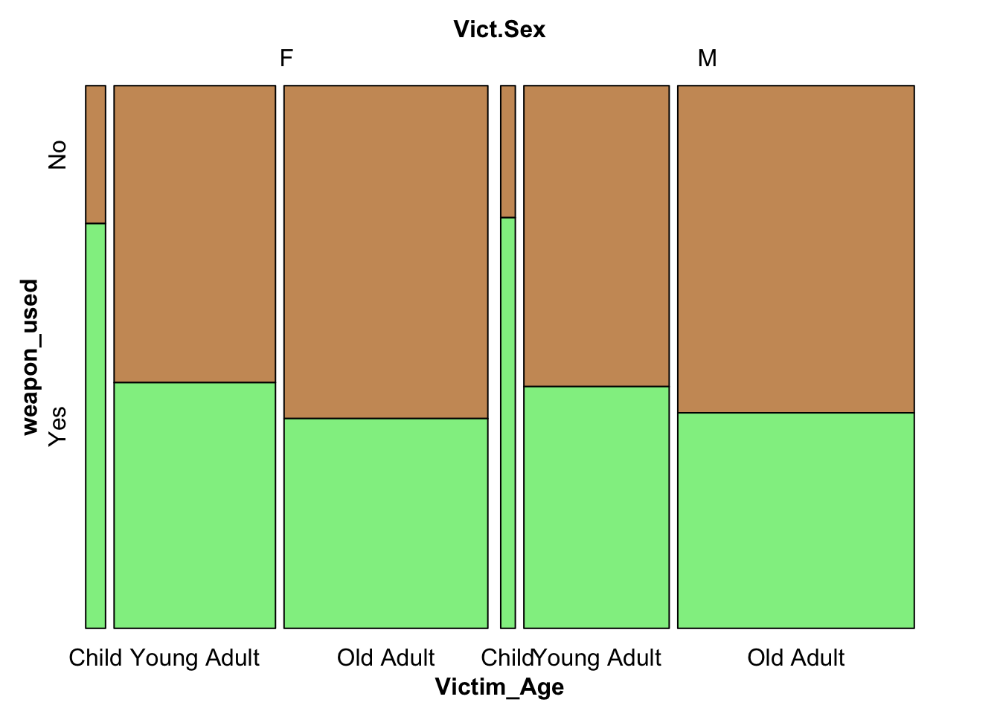
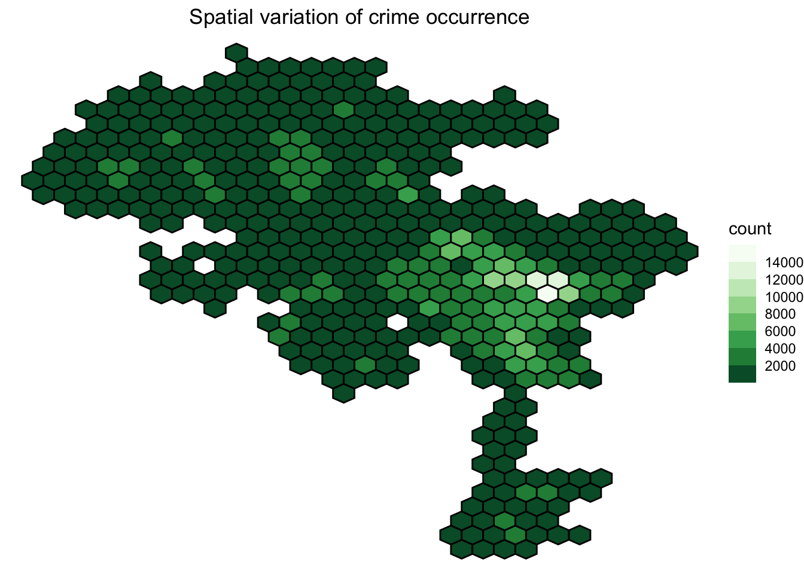
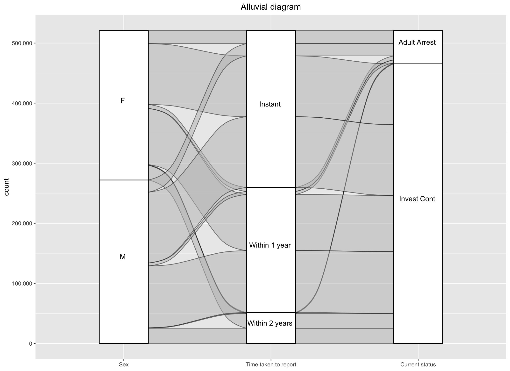

## Analyzing Crime in LA
We analyzed crime data in Los Angeles using R (ggplot2) and d3.js for interactive visualizations to explore how factors like race, gender, area, and time influence crime trends and victim susceptibility. Our study examined the impact of COVID-19 on crime rates, progression of neighborhood crime over the years, and demographic factors affecting sexual crime susceptibility. We also identified safer neighborhoods based on crime prevalence. Our dataset can be found here: https://data.lacity.org/Public-Safety/Crime-Data-from-2020-to-Present/2nrs-mtv8 

## Some of our interesting results include:

### Weapon Usage and Age category of Victim
To understand the association of weapon usage with victim age groups and victim sex, we plot a mosaic plot. The ages have been divided into three categories: ‘Child’ comprising of individuals of age less than or equal to 18 years, ‘Young Adult’ comprising of individuals of age 19 to 34 years, and ‘Old Adult’ comprising of ages 35 plus years:

From the above mosaic plot, we observe that crimes against children are where weapons are most used, leading to the consideration that it may be because children usually are defenseless victims and are unaware of their surroundings. For adults, both young and old, crimes occur without a weapon majorly. There are also more female child victims than male, but more male old adult victims than female.

### Crime Coordinate System
To study the spatial variation of crime occurrences and try to understand which areas in Los Angeles are most susceptible to crime, we firstly proceed by removing the rows that have 0 as LON or LAT, since that was a preprocessing done by the dataset providers when the longitude and latitude was not identified. After this, we move on to bin the crime instances into 30 hex bins, and observe the spatial distribution of crimes in the form of a heat map.

From the above map, we observe that eastern and slightly central LA have higher cases of crime occurring than the left and south parts of LA. Comparing this heatmap to an actual land map (See here for land map ), in particular the areas of South and Downtown LA are high-crime areas, with more than 10,000 cases occurring in that bin over three years.

### Reporting Crime and its Consequences
To investigate this aspect of crime involving fear or shame of a victim in reporting crime, we will plot an Alluvial diagram that represents the flow of crime instances across Victim Sex, the difference in date reported and date occurred of the crime, and the status of the crime that was reported (whether the investigation is still continuing or the adult has been arrested). Due to less cases in juvenile perpetrators and unknowns and the ambiguity of ‘Adult Other’ category, we will focus only on the two categories of status of crime. The difference in dates reported have been classified into three options: Instant (where the crime is instantly reported on the same exact day as committed), 1 year (when the difference is less than 365 days), and 2 years (when the difference is less than 730 days but more than a year).

From the above alluvial diagram, on observing the flow from victim sex all the way to the end which is the status of the crime, we notice that firstly most of the adult arrests status crimes have resulted when the crime was reported instantly and very few result from those that have been reported 1-2 years after the crime (giving us some idea on the importance of immediate evidence needed in most cases). Mostly all cases reported after a year have their investigation still continuing. Secondly, out of all the Female victims, less than half report instantly, and the rest take more time than that, whereas it is the opposite for male victims where more than half report instantly.

## To replicate our results:
- In the additional_scripts you will find the file 'cleaning.qmd' we use to run our graphs.
- A smaller sized file created from our cleaned dataset is stored in 'Safety.csv'. The steps to recreate this can be found in 'MakingSafetycsv.qmd' in the addition_scripts folder. 
- To run the interactive plot please select the AM-PM button and then click on the desired time button to view the risk of crime for each gender!

## Contributors

<a href="https://github.com/zainab2303">
  
   
  Zainab Shakruwala
</a>
<a href="https://github.com/abm2211">
  
   
  Aneri Modi
</a>
